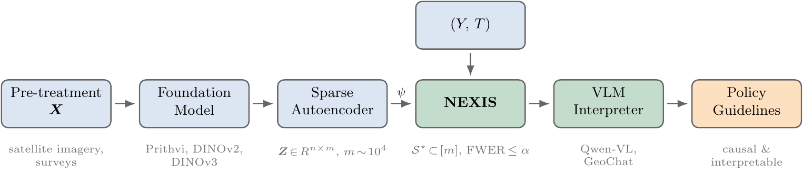

# NEXIS — Neural EXposure Interaction Search

**From Tokens to Policy: Causal and Interpretable Heterogeneous Treatment Effects Identification**

*Riccardo Cadei*, Frank Otchere, Nyasha Tirivayi, Gustavo Angeles Tagliaferro, Falco J. Bargagli-Stoffi, Francesco Locatello · *Under review, 2026* · [Website](https://riccardocadei.github.io/NEIS/) · [Workshop paper](assets/aistats26-workshop.pdf)

**TL;DR:** We introduce NEXIS, an iterative procedure over sufficient and principally aligned representations for effect heterogeneity, to identify its causal characterization, i.e., answering questions as "*what if* or *how* should I modify my treatment assignement policy?".

## Causal and Interpretable Heterogeneous Treatment Effects Identification



<ol type="i">
  <li>
    <strong>Run a controlled experiment</strong> and observe that the treatment effect varies across units — but which pre-treatment features actually <em>cause</em> that variation?
  </li>

  <li>
    <strong>Represent complex measurements</strong> (satellite imagery, medical imaging, …) via a foundation model + Sparse Autoencoder, producing thousands of sparse, interpretable candidate neurons alongside any structured covariates.
  </li>

  <li>
    <strong>Identify the direct effect modifiers</strong> — NEXIS runs a forward-backward Markov-blanket search over the candidate neurons, testing conditional CATE-equivalence at each step with Bonferroni-gated p-values, and returns a small set S* with FWER ≤ α. Each selected neuron is automatically labelled by a VLM (Qwen-VL, GeoChat) using top/bottom activating patches.
  </li>

  <li>
    <strong>Update policy accordingly</strong> — the output is a causal and interpretable characterisation of who benefits most, directly actionable for program adaptation.
  </li>
</ol>


---

## Install

```bash
pip install -e .
```

## Quick start

```python
from src.method import nexis

result = nexis(y=Y, t=T, z=Z, alpha=0.05)
print(result.selected)   # indices of selected neurons in Z
print(result.pvalues)    # Bonferroni-gated p-values at each step
```

**Key parameters:**

| Parameter | Default | Description |
|-----------|---------|-------------|
| `alpha` | `0.05` | FWER significance level |
| `test` | `"linear"` | Test variant: `"linear"` (fast, parametric interaction t-test) or `"GCM"` (nonparametric, model-free) |
| `backward` | `True` | Enable backward pruning step (forward-only if `False`) |
| `adjust` | `"FWER"` | Multiple-testing correction: `"FWER"` (Bonferroni), `"FDR"` (Benjamini-Hochberg), or `None` |
| `rho` | `0.5` | Spectral-gap threshold: stop forward if new candidate's \|t\| < ρ · min\|t\| of already-selected |
| `w` | `None` | Optional (n, q) matrix of structured covariates; screened jointly with Z |

See [`src/method/nexis.py`](src/method/nexis.py) for all options and method variants.

---

## Reproducing experiments

Scripts target SLURM but run equally with `bash` locally. GPU is required for foundation-model embedding extraction, SAE training, and VLM interpretation; the NEXIS selection step itself is CPU-only.

### CelebA — semi-synthetic benchmark

**Data**: CelebA face images — download from the [official source](https://mmlab.ie.cuhk.edu.hk/projects/CelebA.html) and place at `data/celeba/`.

```bash
bash scripts/celeba/submit_embed.sh       # SigLIP embeddings
bash scripts/celeba/submit_sae.sh         # train SAE
bash scripts/celeba/submit_experiment.sh  # NEXIS sweeps (effect size × sample size)
python src/apps/celeba/figure_main.py
python src/apps/celeba/figure_appendix.py
```

See [`notebooks/celeba.ipynb`](notebooks/celeba.ipynb) for interactive exploration.

### Uganda YOP — real-world application

**Satellite data**: Landsat 7 composite via Google Earth Engine.
```bash
pip install earthengine-api
earthengine authenticate --auth_mode notebook
earthengine set_project <your-gee-project-id>
python src/apps/uganda/download_tiles.py --mode rct
```

**Survey data**: Available from the [World Bank Microdata Library](https://microdata.worldbank.org/) — search "Uganda Youth Opportunities Programme".

```bash
# Full pipeline: embedding → SAE → NEXIS → VLM interpretation → figures
bash scripts/uganda/run.sh --models=prithvi,dinov2,dinov3 --all-outcomes

# Skip embedding/SAE (use existing), re-run analysis only
bash scripts/uganda/reanalyze.sh --models=prithvi --all-outcomes
```

`--models=`: `prithvi`, `dinov2`, `dinov3`, `dinov2_large`  
`--outcomes=`: `log_skilled_hours`, `skilled_employed`, `skilled_fulltime`, `log_training_hours`, `log_earnings`, `log_biz_assets`, `wellbeing`, `wealth_index`

See [`notebooks/uganda.ipynb`](notebooks/uganda.ipynb).

### Ghana LEAP 1000 — real-world application

**Satellite data**: Landsat 8 composite via Google Earth Engine (same setup as Uganda):
```bash
python src/apps/ghana/download_satellite_images.py --year 2015
```

**Survey data**: The LEAP 1000 2015–2017 household panel is not publicly available — contact UNICEF Ghana directly if interested in access.

```bash
bash scripts/ghana/slurm_train_sae.sh
bash scripts/ghana/slurm_stats.sh
bash scripts/ghana/slurm_interpret_7b.sh   # Qwen-VL 7B
bash scripts/ghana/slurm_interpret.sh      # Qwen-VL 72B
bash scripts/ghana/run_figure_neural.sh
```

See [`notebooks/ghana.ipynb`](notebooks/ghana.ipynb).

---

## Citation

```bibtex
@article{cadei2026nexis,
  title   = {From Tokens to Policy: Causal and Interpretable Heterogeneous Treatment Effects Identification},
  author  = {Cadei, Riccardo and Otchere, Frank and Tirivayi, Nyasha and Angeles Tagliaferro, Gustavo and Bargagli-Stoffi, Falco J. and Locatello, Francesco},
  year    = {2026},
  note    = {Under review. Preprint coming soon.}
}
```
