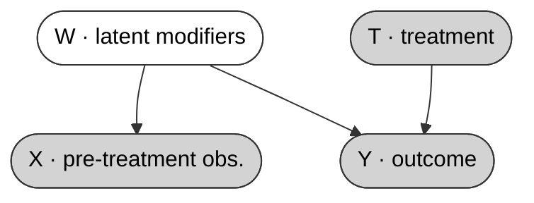

# Generalised Heterogeneous Treatment Effect (HTE) Identification

**Identifying drivers of treatment effect heterogeneity from high-dimensional pre-treatment data.**

Treatment effects vary across individuals — but detecting *which features* drive this heterogeneity is challenging when you have thousands of candidate variables. **NEMS** is a method for identifying effect modifiers (features that predict differential treatment response) from high-dimensional pre-treatment data, while controlling the family-wise error rate. It is designed for the regime where [features >> samples], where naive interaction screening fails.

### Problem setup

Consider a randomised experiment with treatment **T**, outcome **Y**, and pre-treatment observations **X** (e.g. satellite imagery embeddings, genomic profiles, or any high-dimensional proxy). We posit a set of *latent* effect-modification factors **W** that are not directly observed but manifest in both **X** and the heterogeneous response to treatment:



*Shaded nodes are observed; the white node **W** is unobserved. Pre-treatment data **X** is a (potentially high-dimensional) proxy for the latent effect modifiers **W**, which also determine how units respond differentially to treatment.*

The goal is to identify the drivers of effect heterogeneity — that is, to recover informative proxies for **W** from the available data. In practice, the inputs to NEMS are not limited to a single high-dimensional source: **X** can combine learned representations (e.g. Sparse Autoencoder neurons extracted from a vision model) with interpretable measured pre-treatment variables that the researcher already has — demographic covariates, survey responses, administrative records, or any other baseline variables believed to be informative about effect modification. NEMS thus provides a unified, multiply-tested screen over this combined feature space, regardless of whether features come from deep models or from domain knowledge.

### Motivating example — Uganda Youth Opportunities Programme

A concrete instantiation pairs randomised experiments with satellite imagery: given an RCT with treatment `T` and outcomes `Y`, and pre-treatment satellite imagery from unit locations, modern vision models (e.g. Prithvi, DINOv2) extract rich spatial features, and Sparse Autoencoders map these to interpretable individual neurons. Given the resulting high-dimensional embedding `Z`, the question becomes: *which learned features interact with treatment to drive outcome differences?* NEMS provides a principled answer — and can simultaneously screen any additional measured covariates alongside the learned features.

---

## Method

Given an RCT or observational dataset `(Y, T, Z)`, NEMS iteratively selects neurons `j` by testing the conditional interaction hypothesis

```
H0(j | S) : γ_j = 0   in   Y ~ 1 + T + Z_S + T·Z_S + Z_j + T·Z_j
```

conditioning on the already-selected set `S`. At each step a Bonferroni gate is applied over all remaining candidates, so the family-wise error rate is controlled throughout. Selection stops when no remaining neuron clears the gate.

The procedure is designed for the high-dimensional regime (`p >> n`) where a naïve interaction screen would produce far too many false discoveries. By conditioning on the growing selected set and gating with Bonferroni, NEMS achieves valid sequential selection without requiring post-hoc adjustment.

```python
from src import nems_select

result = nems_select(y=Y, t=T, z=Z, alpha=0.05)
print(result.selected)   # list of selected neuron indices
```

---

## Related work

The closest prior work is [Jerzak, Johansson & Daoud (2023)](https://proceedings.mlr.press/v213/jerzak23a.html), who also pair satellite imagery with the Uganda YOP to characterise effect heterogeneity. Their approach uses black-box CATE estimators (BART, causal forests) applied to raw or projected embeddings, producing a smooth predicted-effect surface. NEMS differs in three key respects:

| | Jerzak et al. (2023) | Causal forests / X-Learner | **NEMS** |
|---|---|---|---|
| Goal | Predict CATE as a function | Predict CATE as a function | **Select effect modifiers** |
| Multiple-testing guarantee | None | None | **FWER controlled** |
| p >> n regime | Regularised regression | Regularised regression | **Sequential conditional testing** |
| Interpretability | Raw embedding dimensions | Raw covariates | **SAE neurons + VLM labels** |

More broadly, generic CATE estimators (causal forests, X-Learner, DR-learner) estimate the full effect surface but do not identify *which features* drive heterogeneity in a statistically tested sense. Marginal interaction screens — even when Bonferroni-corrected — test each candidate independently, inflating false discoveries when features are correlated. NEMS instead conditions each new test on the features already selected, sequentially narrowing the search while maintaining valid FWER control throughout.

---

## Experiments

### Uganda Youth Opportunities Programme

We apply NEMS to the Uganda YOP, a cash-and-training RCT in northern Uganda ([Blattman, Fiala & Martinez, 2014](https://doi.org/10.1093/qje/qju003)). We pair each participant with pre-treatment satellite imagery (year 2000) and extract learned features using **Prithvi** (geospatial foundation model) and **DINOv2**. A Sparse Autoencoder trained on top maps the dense embedding to sparse, interpretable neurons; NEMS then screens these neurons — together with any additional measured covariates — for treatment effect modification.

For the primary outcome **log skilled-trade hours** (n = 2,372, ATE = +0.020, p < 0.001), NEMS selects 2 effect modifiers:

| Rank | Feature | Interpretation | GATE (inactive) | GATE (active) | Δ CATE | p-value |
|------|---------|----------------|----------------|--------------|--------|---------|
| 1 | SAE\_659 | No perennial water source | −0.001 | +0.038 | **+0.039\*** | 3.0 × 10⁻⁶ |
| 2 | lang\_6  | Lugbara language region    | +0.030 | −0.003 | **−0.033\*** | 1.8 × 10⁻³ |

> \* 95% CI of Δ CATE excludes zero.

The programme is substantially more effective in drier areas without perennial water — a finding invisible to average-effect analysis and not surfaced by prior work on this trial. Below: GATE estimates, geographic distribution, treatment balance, and the satellite patches most/least activating each selected neuron (Prithvi encoder).


**To reproduce**, see [notebooks/uganda.ipynb](notebooks/uganda.ipynb) for the full analysis. Eight outcomes are supported (labour, earnings, assets, wellbeing):

```bash
bash scripts/run.sh --models=prithvi,dinov2 --all-outcomes
```

### Synthetic benchmarks

To validate FWER control and power, we run experiments on synthetic data where the true effect modifiers are known. The benchmark sweeps over effect size and sample size, comparing NEMS against marginal interaction testing (unadjusted and Bonferroni-adjusted). Across all settings NEMS achieves higher power at controlled FWER.

See [notebooks/synthetic.ipynb](notebooks/synthetic.ipynb) to reproduce the benchmark.

---

## Repository structure

```
src/
  nems.py          # core selection algorithm and evaluation utilities
  synthetic.py     # synthetic DGP (loading matrix, RCT generator)
  uganda.py        # Uganda YOP helpers (outcome aliases, mapping, causal utilities)
  train.py         # DINOv2/Prithvi patch embedding extraction + SAE training
  analyze.py       # NEMS feature selection for a given outcome
  interpret.py     # VLM→LLM interpretation of selected SAE features
  summarize.py     # ATE + CATE/GATE summary for a given outcome
  plot_features.py # feature image grids

notebooks/
  synthetic.ipynb  # synthetic benchmark (effect size & sample size sweeps)
  uganda.ipynb     # Uganda YOP real-data analysis

scripts/
  run.sh           # full pipeline (embedding → SAE → NEMS → interpret → summarize → plot)
  reanalyze.sh     # re-run analysis steps only (skips embedding/SAE training)

papers/
  aistats26-workshop.pdf  # NEMS workshop paper (AISTATS 2026)

results/
  uganda/
    map.png
    {model}_{dim}/{outcome}/   # NEMS results per (model, outcome)
  synthetic/
    linear/        # saved PDF figures — linear DGP
    quadratic/     # saved PDF figures — quadratic DGP

data/              # real-world datasets (not tracked by git)
```

---

## Citation

If you use NEMS, please cite our paper (see [papers/aistats26-workshop.pdf](papers/aistats26-workshop.pdf)):

```bibtex
@article{nems2025,
  title   = {},
  author  = {},
  journal = {},
  year    = {2025},
  note    = {Preprint coming soon}
}
```


