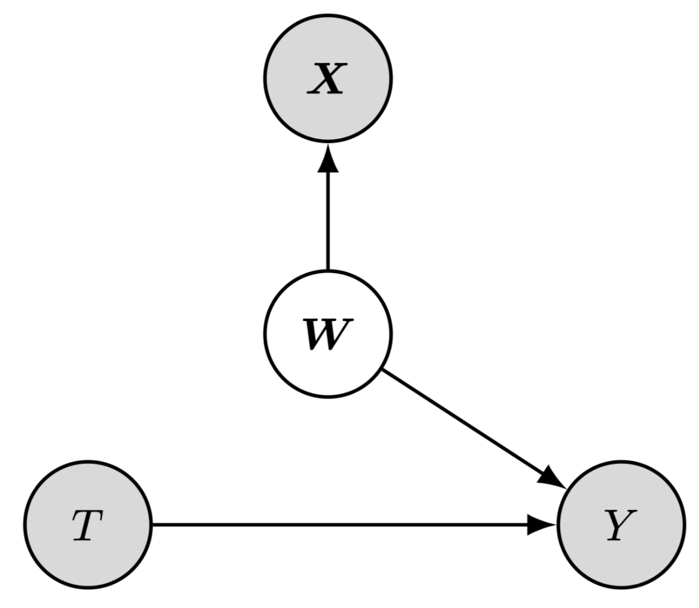
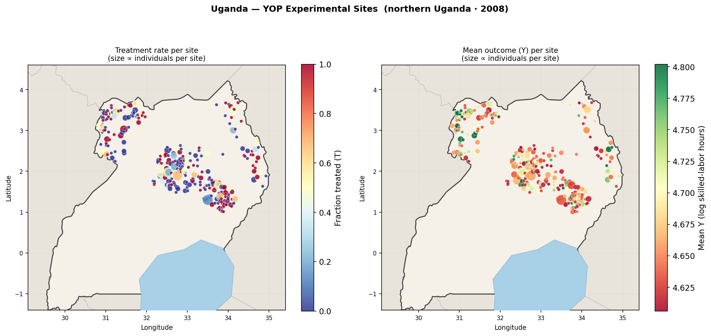

# Generalised Heterogeneous Treatment Effect (HTE) Identification

**TL;DR:** *Generalised identification of what drives heterogeneous treatment effects — combining complex pre-treatment measurements with interpretable domain priors.*

Understanding *why* treatment effects vary across individuals is a fundamental challenge in causal inference. Standard methods predict effect variation but cannot reliably identify which specific features actually drive the heterogeneity, nor do they offer statistical guarantees. To address this, we introduce **NEMS** (Neural Effect Modifier Search): a framework providing a powerful **hypothesis generation** component. It sequentially tests and selects genuine effect modifiers from a vast pool of candidates while strictly controlling the family-wise error rate (FWER).

Our approach is generalised in the sense that the input feature space is unrestricted and can freely combine (i) complex, high-dimensional pre-treatment measurements such as representations from foundation models (satellite imagery, medical imaging), and (ii) interpretable prior variables (demographics, administrative records). By linking mechanistic interpretability with causal inference, NEMS bridges the gap between opaque deep learning features and statistically rigorous hypothesis generation.

### Problem setup

<table>
<tr>
<td valign="middle" width="62%">

Consider a randomised experiment with treatment **T**, outcome **Y**, and pre-treatment observations **X**. We posit a set of effect-modification factors **W** (some latent and some partially observed). Our framework is **generalised** as it aims to identify effects directly by combining complex measurements with domain priors, both of which serve as observable manifestations of **W** acting on **X** and driving the heterogeneous response to treatment (see figure).

The pre-treatment input **X** is the union of two complementary sources:

- **Complex measurements** — high-dimensional representations extracted from raw data (satellite imagery, sensor readings, omics), typically via a foundation model + Sparse Autoencoder, yielding thousands of candidate neurons
- **Interpretable priors** — measured baseline variables the researcher already has (demographics, survey items, administrative records), entered directly as additional candidates

NEMS screens the combined candidate set for treatment effect modification, conditioning each new test on the features already selected and applying a Bonferroni gate, so that FWER is controlled throughout regardless of the total number of candidates.

*Shaded nodes are observed; the node **W** can be latent or partially observed.*

</td>
<td valign="middle" align="center" width="38%">

<br/>
<sub><b>Causal model:</b> Some pre-treatment variables <b>W</b>, latent (entangled in a complex measurement <b>X</b>) or partially observed, drive the heterogeneous response to treatment <b>T</b> on outcome <b>Y</b>.</sub>
</td>
</tr>
</table>

### Motivating example — Uganda Youth Opportunities Programme

A concrete instantiation pairs randomised experiments with satellite imagery: given an RCT with treatment `T` and outcomes `Y`, and pre-treatment satellite imagery from unit locations, modern vision models (e.g. Prithvi, DINOv2, DINOv3) extract rich spatial features. Sparse Autoencoders then map these dense embeddings to interpretable individual neurons. Given the resulting high-dimensional representation `Z`, the question becomes: *which learned features meaningfully interact with treatment to drive outcome differences?* NEMS provides a principled selection, while simultaneously screening explicit covariates alongside the learned deep features.

---

## Method

The pipeline proceeds in three distinct stages.

---

### Step 1 — Representation learning

Raw pre-treatment observations (e.g. satellite imagery) are first passed through a **foundation model** — such as Prithvi (geospatial) or DINOv2/DINOv3 (vision) — to obtain dense, high-dimensional patch embeddings. These embeddings are then fed to a **Sparse Autoencoder (SAE)**, which decomposes the dense representation into a large number of sparse, near-monosemantic neurons. Each neuron captures a specific, human-interpretable visual concept (e.g. *presence of water*, *road density*, *vegetation type*). The result is a high-dimensional but structured feature matrix $Z \in \mathbb{R}^{n \times p}$, with $p$ potentially reaching thousands of candidates, that forms the input to the selection stage.

---

### Step 2 — Neural Effect Modifier Search

Given the combined candidate matrix $Z$ (SAE neurons + any additional measured covariates) and an RCT or observational dataset $(Y, T)$, NEMS iteratively selects a feature or neuron $j$ by testing the conditional interaction hypothesis:

$$
\mathcal{H}_0(j \mid S) : \quad \gamma_j = 0 \quad \text{in} \quad Y \sim 1 + T + Z_S + T \cdot Z_S + Z_j + T \cdot Z_j
$$

The null hypothesis $\mathcal{H}_0$ conditions on the already-selected set $S$. At each step, a Bonferroni gate is applied uniformly over all remaining candidates, sequentially narrowing the search while guaranteeing tight control over the family-wise error rate (FWER) throughout. Selection automatically halts when no remaining candidate clears the gated significance threshold.

```python
from src import nems_select

result = nems_select(y=Y, t=T, z=Z, alpha=0.05)
print(result.selected)   # list of selected neuron indices
```

---

### Step 3 — Interpretation

Once NEMS selects a set of neurons, each selected neuron is interpreted using a **Vision-Language Model (VLM)** pipeline. For every selected neuron $j$, the top-activating and bottom-activating satellite patches are retrieved and passed to a VLM (e.g. Qwen-VL, GeoChat) with a structured prompt asking what visual concept the neuron responds to. The per-patch captions are then aggregated by an LLM into a concise, human-readable description (e.g. *"areas without perennial water sources"*). This yields a fully interpretable summary of each effect modifier, grounding statistically selected neurons in domain-meaningful language.

---

## Experiments

### Uganda Youth Opportunities Programme



We apply NEMS to the Uganda YOP, a cash-and-training RCT in northern Uganda ([Blattman, Fiala & Martinez, 2014](https://doi.org/10.1093/qje/qju003)). We pair each participant with pre-treatment satellite imagery (year 2000) and extract learned features using **Prithvi** (geospatial foundation model), **DINOv2**, and **DINOv3**. A Sparse Autoencoder trained on top maps the dense embedding to sparse, interpretable neurons; NEMS then screens these neurons — together with any additional measured covariates — for treatment effect modification.

For the primary outcome **log skilled-trade hours** (n = 2,372, ATE = +0.020, p < 0.001), NEMS selects 2 effect modifiers:

| Rank | Feature | Interpretation | GATE (inactive) | GATE (active) | Δ CATE | p-value |
|------|---------|----------------|----------------|--------------|--------|---------|
| 1 | SAE\_659 | No perennial water source | −0.001 | +0.038 | **+0.039\*** | 3.0 × 10⁻⁶ |
| 2 | lang\_6  | Lugbara language region    | +0.030 | −0.003 | **−0.033\*** | 1.8 × 10⁻³ |

> \* 95% CI of Δ CATE excludes zero.

The programme is substantially more effective in drier areas without perennial water — a finding invisible to average-effect analysis and not surfaced by prior work on this trial. Below: GATE estimates, geographic distribution, treatment balance, and the satellite patches most/least activating each selected neuron (Prithvi encoder).


**To reproduce**, note that notebooks are primarily for visualisation: [notebooks/uganda.ipynb](notebooks/uganda.ipynb). The actual reproducible end-to-end experiments (supporting eight outcomes like labour, earnings, assets, wellbeing) run via the overarching command pipeline script:

```bash
bash scripts/run.sh --models=prithvi,dinov2,dinov3 --all-outcomes
```

### Synthetic benchmarks

To validate FWER control and power, we run experiments on synthetic data where the true effect modifiers are known. The benchmark sweeps over effect size and sample size, comparing NEMS against marginal interaction testing (unadjusted and Bonferroni-adjusted). Across all settings NEMS achieves higher power at controlled FWER.

See [notebooks/synthetic.ipynb](notebooks/synthetic.ipynb) to reproduce the benchmark.

---

## Repository structure

```
src/
  nems.py          # core selection algorithm and evaluation utilities
  synthetic.py     # synthetic DGP (loading matrix, RCT generator)
  uganda.py        # Uganda YOP helpers (outcome aliases, mapping, causal utilities)
  train.py         # DINOv2/Prithvi patch embedding extraction + SAE training
  analyze.py       # NEMS feature selection for a given outcome
  interpret.py     # VLM→LLM interpretation of selected SAE features
  summarize.py     # ATE + CATE/GATE summary for a given outcome
  plot_features.py # feature image grids

notebooks/
  synthetic.ipynb  # synthetic benchmark (effect size & sample size sweeps)
  uganda.ipynb     # Uganda YOP real-data analysis

scripts/
  run.sh           # full pipeline (embedding → SAE → NEMS → interpret → summarize → plot)
  reanalyze.sh     # re-run analysis steps only (skips embedding/SAE training)

assets/
  aistats26-workshop.pdf  # NEMS workshop paper (AISTATS 2026)
  causal_model.png        # causal DAG figure used in README

results/
  uganda/
    map.png
    {model}_{dim}/{outcome}/   # NEMS results per (model, outcome)
  synthetic/
    linear/        # saved PDF figures — linear DGP
    quadratic/     # saved PDF figures — quadratic DGP

data/              # real-world datasets (not tracked by git)
```

---

## Citation

If you use NEMS, please cite our paper (see [assets/aistats26-workshop.pdf](assets/aistats26-workshop.pdf)):

```bibtex
@article{nems2025,
  title   = {},
  author  = {},
  journal = {},
  year    = {2025},
  note    = {Preprint coming soon}
}
```


